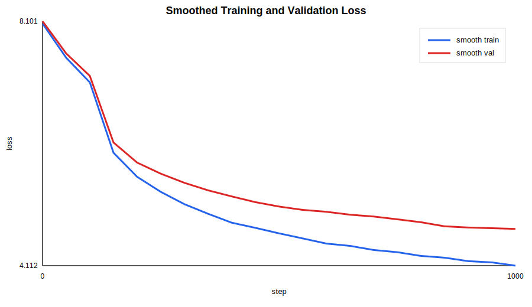

# LLaMA From Scratch 实验报告

## 实验概览

本次实验使用当前项目中的 LLaMA 风格 Decoder-only Transformer，在 `data/input.txt` 上进行小规模语言模型训练，并自动记录训练日志、验证集损失与损失曲线。

## 训练配置

| 项目 | 数值 |
|---|---:|
| batch size | 8 |
| block size | 128 |
| dim | 128 |
| layers | 2 |
| heads | 4 |
| max steps | 1000 |
| eval interval | 50 |
| eval iters | 20 |
| smooth window | 5 |
| learning rate | 0.0005 |
| weight decay | 0.01 |

## 结果摘要

| 指标 | 初始 | 最终 | 下降量 |
|---|---:|---:|---:|
| train loss | 11.0184 | 4.0807 | +6.9377 |
| val loss | 11.0175 | 4.7568 | +6.2608 |
| train perplexity | 60983.71 | 59.19 | - |
| val perplexity | 60934.17 | 116.37 | - |

损失曲线仅绘制平滑后的 loss，平滑窗口为 `5` 个评估点。

## 产物位置

- 运行目录：`runs/20260620_140958`
- 训练日志：`metrics.csv`
- 损失曲线：`loss_curve.svg`
- 配置快照：`config.json`

## 结论

训练损失从 `11.0184` 下降到 `4.0807`，说明当前模型、数据管道与反向传播链路能够正常工作。

验证损失从 `11.0175` 变化到 `4.7568`。由于本实验是小规模快速训练，结果主要用于验证工程闭环，而不是追求最终语言建模效果。

下一步更有价值的实验包括：

- 使用更长训练步数观察稳定收敛趋势。
- 保存 checkpoint 后用 `generate.py --checkpoint` 评估生成质量。
- 对比开启与关闭 KV Cache 的生成速度。
- 加入更系统的超参数消融实验。
